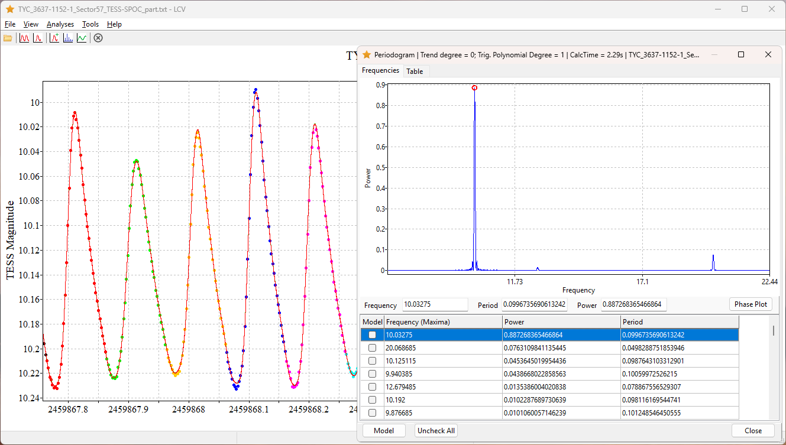
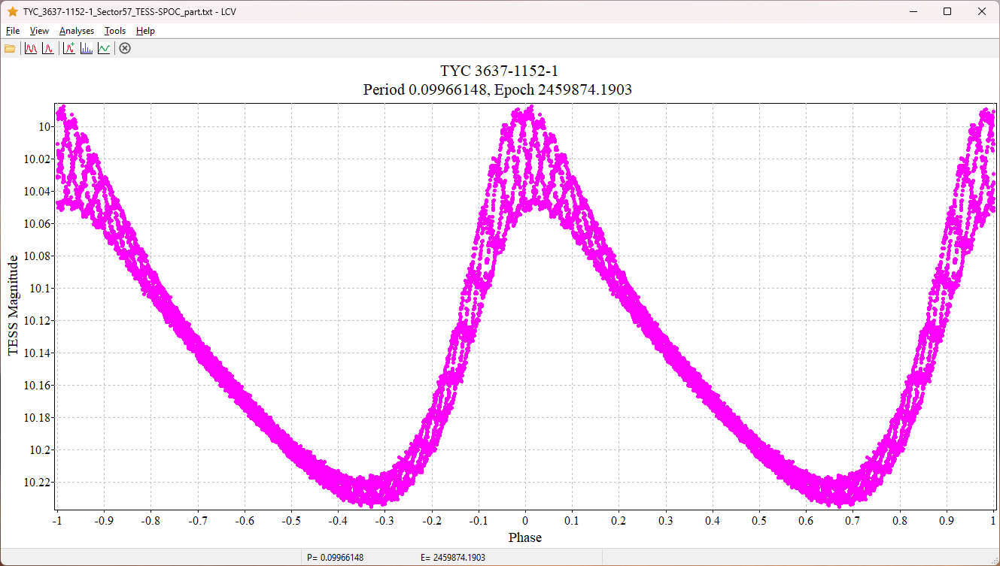

## Light Curve Viewer

This program implements some methods from:

* Andronov, I. L., (Multi-) Frequency Variations of Stars. Some Methods and Results, Odessa Astronomical Publications, vol. 7, p. 49-54 (1994) [1994OAP.....7...49A](https://ui.adsabs.harvard.edu/abs/1994OAP.....7...49A/abstract)

* Andronov, I. L., Advanced Time Series Analysis of Generally Irregularly Spaced Signals: Beyond the Oversimplified Methods, Knowledge Discovery in Big Data from Astronomy and Earth Observation, 1st Edition. Edited by Petr Skoda and Fathalrahman Adam. ISBN: 978-0-128-19154-5. Elsevier, 2020, p.191-224 [2020kdbd.book..191A](https://ui.adsabs.harvard.edu/abs/2020kdbd.book..191A/abstract)

---

The software uses the Intel OneMKL library https://www.intel.com/content/www/us/en/developer/tools/oneapi/onemkl.html

---

Tested in:
* Windows (64), versions 7, 10, 11
* Debian 12, 13
* Linux Mint
* Puppy Linux "Bookworm Pup64 Linux 6.1.148"
